Top-hole Golf
=============

A 3D golf game for the Commodore 64 microcomputer.

Copyright 2020 Matthew Clarke.

1. [Introduction](#introduction)
2. [Main menu](#main_menu)
3. [Signing in](#signing_in)
4. [Settings](#settings)
5. [Game display](#game_display)
6. [Power arc](#power_arc)
7. [Swing mechanic](#swing_mechanic)

#Introduction
Please note: in the following text, JOY2LEFT, JOY2RIGHT, etc. refer to the various controls on the joystick plugged into port 2.

JOYLEFT, JOYRIGHT, etc. refer to the controls on the current player's joystick, which could be either port 1 or port 2.

#Main menu
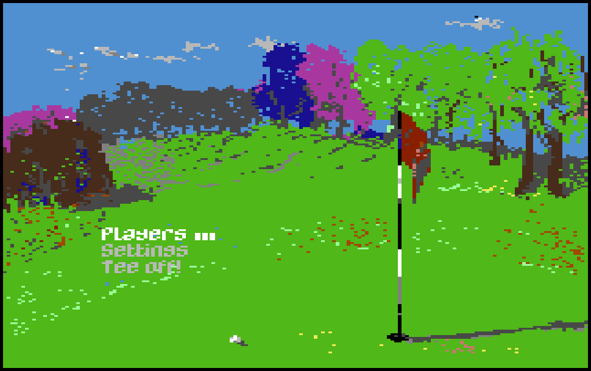

Use JOY2UP and JOY2DOWN to navigate through the items and press JOY2FIRE to select.

The 'notches' next to the 'Players' menu item indicate how many players are currently signed in. For example, in the screenshot above, there are currently three players signed in.

#Signing in
To add a new player or edit an existing one, select 'Players' from the main menu to go to the signing-in screen. In the example below, three players are currently signed in.

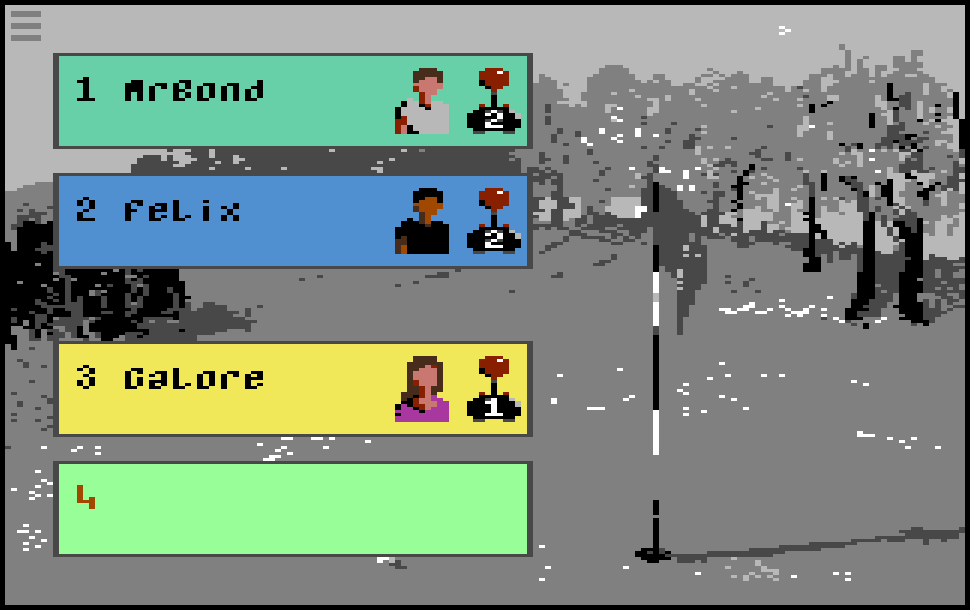

On this screen there are two modes to the user interface: *browse* mode and *edit* mode.

##Browse mode
In browse mode, either one of the slot numbers (1-4) or the 'hamburger' icon at the top left of the screen will be flashing. In the screenshot above, the number '4' is flashing, indicating that we're in browse mode. Use JOY2LEFT/RIGHT/UP/DOWN to navigate through the slots (where appropriate) or to and from the 'hamburger'.

Press JOY2FIRE on the flashing 'hamburger' to go back to the main menu.

Press JOY2FIRE on a flashing number to begin editing an existing player or add a new one.

To delete an existing player, navigate to the appropriate slot and press [INST/DEL] on the keyboard. 

To swap two players, navigate to one of the players so that their slot number is flashing, then press the number of the other player on the keyboard. For example, in the screen above, if we wanted to swap 'MrBond' and 'Galore', we move the joystick up so that number '3' is flashing, then press [1] on the keyboard. This feature is useful for rearranging teams if you're going to play a round with four players and match play scoring.
##Edit mode
You are able to specify five attributes for each player: name, sex, skin color, shirt color and control method (joystick 1 or 2).

Edit the player's name at the flashing cursor, as in the screenshot below. Up to 10 characters can be entered. Delete a single character by pressing [INST/DEL], or the whole string by pressing [C=] \(i.e. the Commodore key) and [INST/DEL]. Press [RETURN] on the keyboard to finish editing the name. If you press [RETURN] on an empty string, the player at this slot is deleted and you will return to *browse* mode.

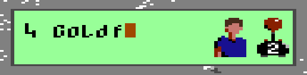

Next you can specify the player's sex, skin color and shirt color. There will be a flashing border around the player's portrait icon (see below). Use JOY2LEFT and JOY2RIGHT to change shirt color, JOY2UP to change sex and JOY2DOWN to change skin color. JOY2FIRE will confirm your selections.

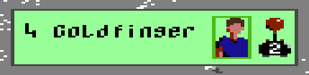

Finally you can set the control method for this player. (A flashing border appears around the josytick icon.) Use JOY2RIGHT to select a joystick in either port 1 or port 2 and press JOY2FIRE to confirm.

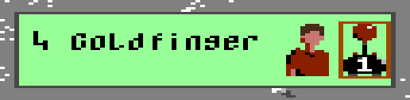

#Settings
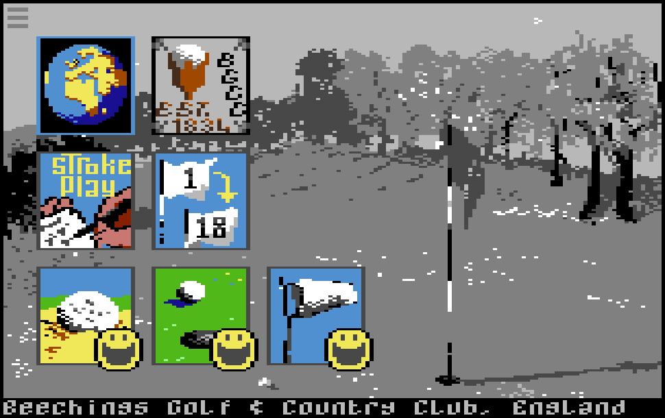

Access the 'settings' screen (as seen above) by selecting the 'Settings' menu item from the main menu.
Six different aspects of the game can be changed: golf course, scoring system, number of holes, and the difficulty of bunkers, greens and wind conditions. Each of these is represented by a large icon on the screen. Use JOY2LEFT/RIGHT/UP/DOWN to navigate through these. To exit to the main menu, navigate to the 'hamburger' icon at the top left of the screen and press JOY2FIRE. Now we will discuss each setting in turn.
##Golf course
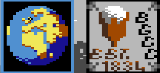

With a flashing border around the 'globe' icon, press JOY2FIRE to browse the different golf courses available. (Use JOY2FIRE to browse through the options for all the other settings as well.) The corresponding club badge will be drawn to the right of the globe. You do not need to 'confirm' your selection in any way - how you leave this setting screen configured will determine the game to be played.
##Scoring system
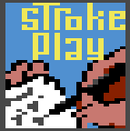

You can choose between *stroke play* and *match play*. In stroke play, the winner is the player who completes the course in the fewest number of strokes. In match play, the round is played per hole, with the winner of each hole earning one point. If the hole is drawn, each player (or team) earns one half point. The winner of the round is the team with the highest score. 

For match play, you need two teams of either one or two players each. If you are playing two against two, players \#1 and \#2 will play against players \#3 and \#4.
##Number of holes
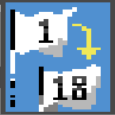

You can elect to play either a full eighteen holes or, for a shorter game, just the front or back nine.
##Bunkers
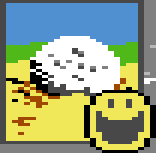

This determines how much your power is decreased if you're in a bunker. Easy = two thirds of full power; intermediate = one half; hard = one third.
##Greens
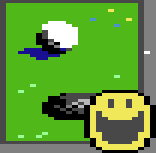

The harder the setting, the steeper the slopes on the greens.
##Wind
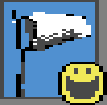

The harder the setting, the stronger the wind conditions.

#Game display
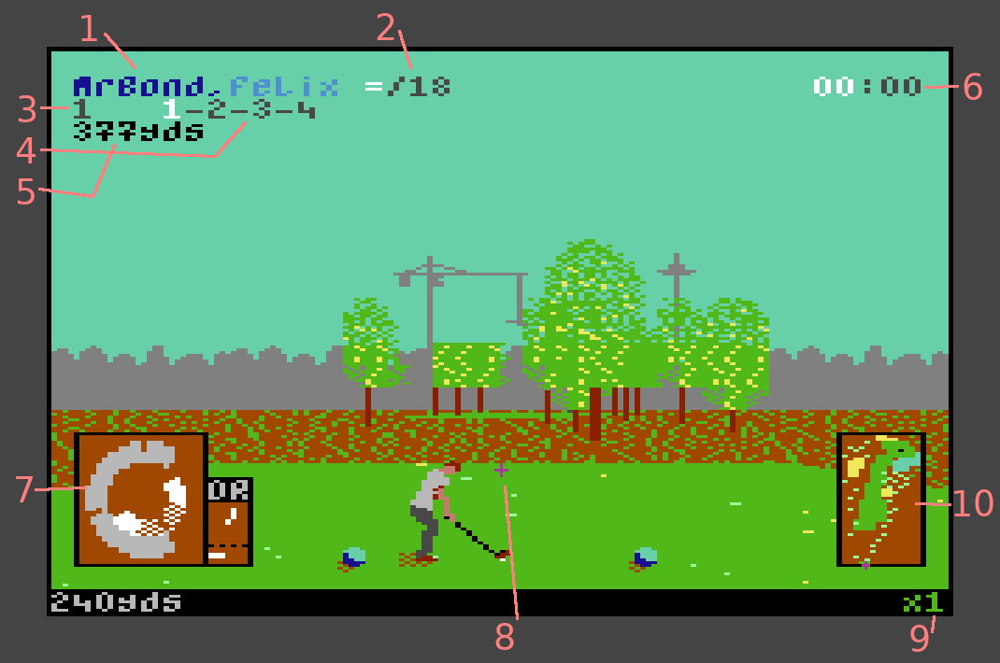

The screen above represents a four-player match play game that is about to start. *MrBond* and *Felix* are playing against *Galore* and *Goldfinger*.

1. **MrBond,Felix:** the current team is *MrBond* and *Felix*, and it's *MrBond's* shot. Note how his name is drawn in dark blue but *Felix* is in light blue.
2. **=/18:** the teams are all square and there are eighteen holes still to play. If this team were two holes up with five holes still to play, you would see **+2/5**.
3. **1:** the current hole.
4. **1-2-3-4:** this is a par 4 hole and *MrBond* is taking his first shot, so the *1* is highlighted in white.
5. **377yds:** the distance to the pin in yards. Once you're on the green, this distance is expressed in feet.
6. **00:00:** this information is for match play only. It shows you how many shots each team has taken so far, with the current team highlighted in white. When a ball has been holed, a small 'notch' appears next to the corresponding team's tally.
7. **The power arc device:** we'll look at this in detail in the next section.
8. **The shot crosshair:** use this to position your shot.
9. **x1:** maximum available power for the current shot. In this example, 100% power is available. When you're in the rough, this will read **x2/3**, meaning your maximum power will be only two thirds of what's potentially available.
10. **Overhead map:** a bird's eye view of the current hole. A pulsing cross shows the position of your ball. The black 'spot' marks the location of the pin.

#Power arc
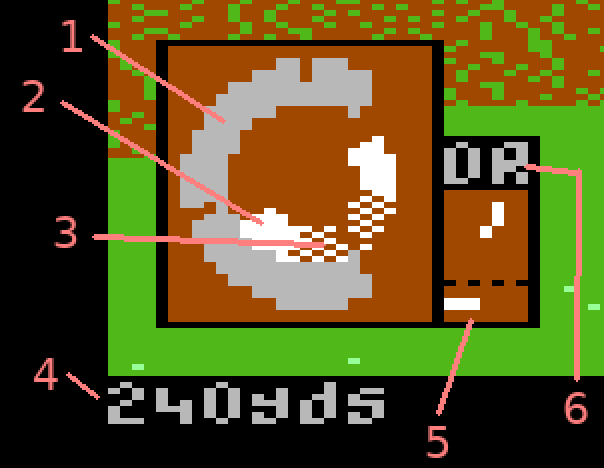

The power arc device and associated panels allow you to select a club and then determine the strength and spin of your shot, as well as providing information about the current wind conditions or, when putting, the slope of the green.

1. **Outer power arc:** shows how much power the shot will have. Maximum power is at the 'notch' at 12 o' clock. Beyond this, power will diminish quite rapidly.
2. **Inner precision arc:** determines how straight your shot is. If the 'precision marker' is stopped at the center, the shot will be perfectly straight. Before this point and your shot will have some hook (or draw), causing it to swerve to the left. After the center point and your shot will have slice (or fade), and will swerve to the right. If you miss the inner arc altogether, you will scuff your shot.
3. **Dithered inner arc:** if you're trying to get out of a bunker, the precision marker must be stopped within the dithered area of the inner arc for the shot to be successful.
4. **Maximum carry:** for the currently selected club, here you will see the maximum carry in yards. This is how far the ball will carry if you hit it from the fairway with 100% power and no wind or spin. Carry is the distance the ball travels up until its first contact with the ground. When putting, this distance is in feet and records the maximum distance the ball will travel with maximum power and no slope.
5. **Wind/slope:** the upper panel shows the direction of the wind or, if on the green, the slope (- it always points **DOWN** the slope!). The lower panel shows the relative strength of the wind, or steepness of the slope. With practice, you'll become adept at judging these relative values.
6. **Club:** the currently selected club. Here we are about to play the driver.

#Swing mechanic

JOYLEFT/RIGHT to set the direction of your shot with reference to the crosshair device.

JOYUP/DOWN to select a club. If in a bunker you can use only the sand wedge (*SW*). And on the putting green, only the putter (*PT*) is available.

Press and hold JOYFIRE. The outer power arc will begin to fill up in a clockwise direction. Release JOYFIRE when you think you have sufficient power. If you release JOYFIRE at exactly 12 o' clock for maximum power, you will receive some aural and visual feedback to confirm this.

After a short pause as your golfer holds the top of the swing, the precision marker will begin to describe the inner arc in a counterclockwise direction, starting at 12 o' clock. Press JOYFIRE at the correct moment, either for a straight shot or to get some draw/fade.
